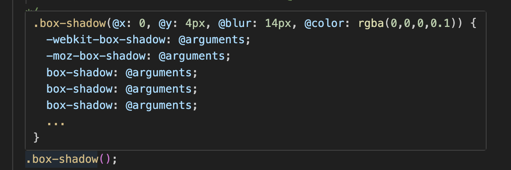
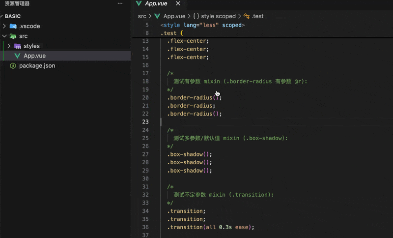
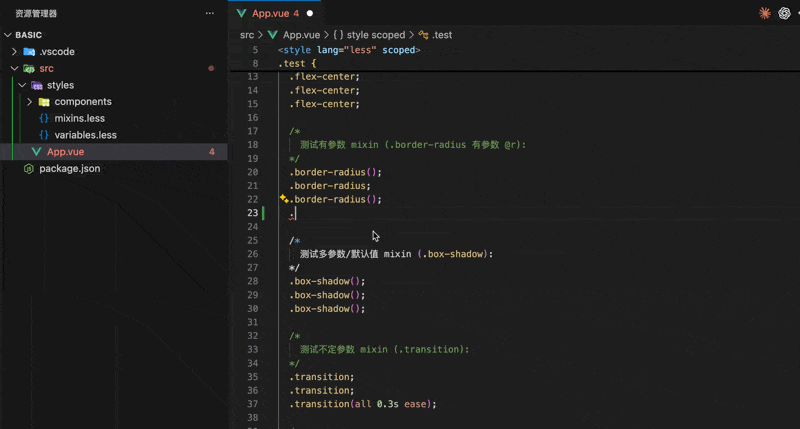

# vue-less-helper

一个用于增强 Vue 与 `.less` 文件中 Less 符号体验的 VS Code 插件。

[English](README.md)

## 当前功能（v0.1.1）

- 在以下语境提供变量/混入补全：
  - `.less` 文件
  - Vue SFC 的 `<style lang="less">` 内部
- 提供变量/混入悬浮提示与定义跳转。
- 补全项可触发自动导入（插入 `@import (reference) '...';`）：
  - 跳过对自身文件导入
  - 默认避免不安全的循环导入
  - 优先导入符号定义文件，而不是入口聚合文件
- 以 `lessFiles` 为入口，递归索引其 `@import` 链路中的变量与混入。
- 补全预览与悬浮预览保持一致。
- 混入预览 body 最多展示 5 行，超出显示 `...`。
- 支持多根工作区：
  - 每个工作区根目录独立索引
  - 补全/悬浮/定义/自动导入按当前文件所在根目录解析

## 效果展示

悬浮提示：



跳转定义：



补全提示：



## 核心功能支持矩阵

| 功能点 | 是否支持 | 说明 |
| --- | --- | --- |
| `.less` 文件内变量/混入补全 | 是 | 变量 `@`、混入 `.` 触发。 |
| Vue `<style lang="less">` 内补全 | 是 | 仅在 `lang="less"` 的 style 块内生效。 |
| Vue 非 less style 内补全 | 否 | 明确不生效。 |
| 变量/混入悬浮提示 | 是 | 与补全预览格式保持一致。 |
| 变量/混入定义跳转 | 是 | 支持跳转到定义文件位置。 |
| 补全后自动导入 | 是 | 插入 `@import (reference) '...';`。 |
| 自动导入避免自导入 | 是 | 当前文件等于目标文件时跳过。 |
| 自动导入默认避免循环导入 | 是 | 默认阻止不安全循环依赖。 |
| 优先导入符号定义文件（非入口聚合文件） | 是 | 能解析到定义来源时优先使用。 |
| mixin 预览 body 最多 5 行 | 是 | 超出显示 `...`。 |
| 多根工作区隔离 | 是 | 按当前文件所属根目录做符号与导入解析。 |
| 相对路径解析 | 是 | 作为导入/配置路径可用。 |
| 绝对路径解析 | 是 | 作为导入/配置路径可用。 |
| `tsconfig/jsconfig` 别名解析 | 是 | 支持 `baseUrl + paths`。 |

## 配置方式

在工作区 `.vscode/settings.json` 中配置：

```json
{
  "vueLessHelper.lessFiles": [
    "@/styles/variables.less",
    "@/styles/mixins.less"
  ],
  "vueLessHelper.notice": true
}
```

### 配置项说明

- `vueLessHelper.lessFiles`：用于建立索引的入口 Less 文件列表。
- `vueLessHelper.notice`：当未配置 `lessFiles` 时，是否显示初始化引导提示。

## 路径与别名解析规则

- 支持：
  - 相对路径
  - 绝对路径
  - `tsconfig.json` / `jsconfig.json` 中 `baseUrl + paths` 定义的别名

## 多根工作区使用说明

- 支持多根工作区场景，包括：
  - monorepo
  - 在同一个 VS Code 窗口同时打开多个独立项目
- 建议在每个根目录分别配置 `vueLessHelper.lessFiles`。
- 运行时会按当前文件所属根目录做隔离索引与解析。

## 本地开发与测试

```bash
npm install
npm run compile
npm run test:unit
npm run test:host
npm run test:host:demos
```

`test:host:demos` 会覆盖以下 demo 工作区：

- `demo/basic`
- `demo/tsconfig-alias`
- `demo/jsconfig-alias`
- `demo/demo-multi-root.code-workspace`


## 说明

- 当前解析实现基于正则，覆盖常见 Less 变量/混入写法。
- 为确保结果稳定，建议明确配置 `vueLessHelper.lessFiles`。

## 支持一下

如果这个项目对你有帮助，欢迎点个 Star 支持：

[⭐ Star vue-less-helper](https://github.com/dmxiaoshubao/vue-less-helper)

## 开源协议

MIT
